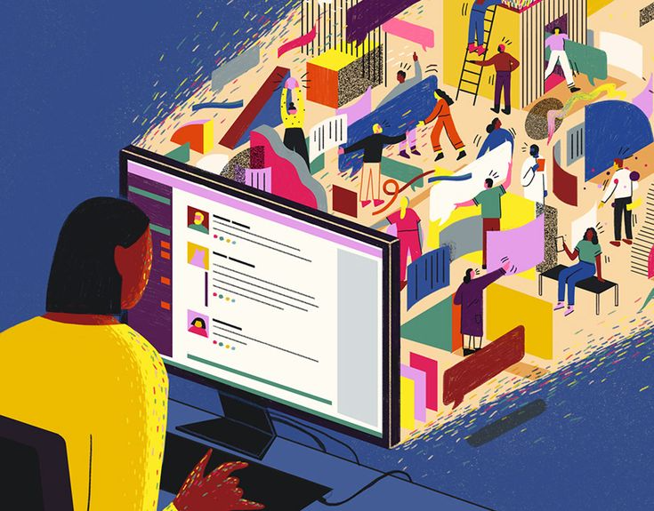

### The true cost of intelligence in Artificial Intelligence is a topic that deserves attention. 

As a Data Scientist working on large language models (**LLMs**) and retrieval-augmented generation (**RAG**) applications for the past year, I've had extensive 
experience with various models and techniques, including Reinforcement Learning using Human Feedback (**RLHF**). For those unfamiliar, RLHF is a method where human feedback 
is used to train and fine-tune machine learning models, particularly in natural language processing(**NLP**) and AI applications. **UHRS supports RLHF by enabling the** 
**collection of human judgments on a large scale**.

In my work, I've collaborated extensively with external partners to obtain and manage data—whether it’s training data, having our current data labeled, 
transcribed, or translated. These tasks are often outsourced to third-party companies that provide a salary and some benefits to their employees. This setup contrasts 
sharply with platforms like **UHRS (Universal Human Relevance System)**, which employs a gig economy model.

**UHRS is a crowdsourcing platform used for human judgment tasks, often by companies like Microsoft, Twitter, and Facebook, to gather human annotations and 
evaluations for various AI and machine learning projects. It serves as a critical component in training and evaluating machine learning models by leveraging human 
judgments to ensure that models perform tasks more accurately and meet desired performance standards**.

#### The backbone of UHRS:

The backbone of UHRS operations lies in its **crowdsourcing platform**, which allows multiple users (or judges) to participate in completing tasks, thereby 
providing a scalable way to gather large amounts of labeled data. Common use cases include search engine evaluation, content moderation, and image and video annotation. 
For instance, Microsoft Bing uses UHRS to evaluate the relevance of search results, while Cortana uses it to improve natural language responses. 
Advertisers also rely on UHRS to evaluate the relevance and appropriateness of ads shown to users.

#### Here's how UHRS works:

Clients create **Human Intelligence Tasks (HITs)** that require human judgment and define the criteria for evaluation, associating a cost with each task that is paid to the 
judge based on the number of correct answers. These HITs are distributed to a pool of judges who complete them according to the provided guidelines. UHRS incorporates 
quality assurance measures, such as gold standard tasks, to ensure the quality of judgments. The collected judgments are then aggregated and analyzed to produce 
the final output required by the client.

#### Human (Inhumane) aspect of UHRS:
Despite its utility, the human aspect of UHRS reveals significant ethical concerns. The platform is gamified to enhance user engagement, where workers earn points or 
scores based on the number of tasks they complete and the quality of their work. High scores can unlock more complex and better-paying tasks, motivating workers to maintain 
high standards. However, the reality of these tasks can be extremely monotonous and mentally taxing, involving activities like drawing rectangles over objects, mapping 
descriptions to images, and tagging the sentiment of pictures. 

More concerning are tasks that involve reviewing and flagging inappropriate or violent content. Workers may be shown disturbing images, videos, or texts that can 
lead to emotional and psychological distress. Continuous exposure to such content can result in secondary traumatic stress, a condition similar to **PTSD**, and burnout 
characterised by emotional exhaustion and reduced personal accomplishment.

#### Exploitation
The compensation for workers involved in content moderation tasks on platforms like UHRS is often a contentious issue. Many reports and studies suggest 
that these workers are frequently underpaid, especially considering the psychological toll their work entails. Content moderators often receive low wages, 
sometimes only slightly above the minimum wage in their respective countries, with the gig economy model leading to inconsistent income. Many tech companies 
outsource content moderation to third-party firms in countries with lower labor costs, resulting in lower compensation for workers. Additionally, gig economy 
workers typically do not receive benefits such as health insurance, paid time off, or retirement plans, further reducing the overall value of their compensation.

#### Reports and Studies
Several reports have highlighted these issues. The Guardian, in 2017, reported on the low wages and challenging working conditions faced by Facebook moderators in India, 
some earning as little as $1 an hour. The Verge, in 2019, detailed the psychological and financial struggles of content moderators in the United States, many of whom were 
paid around $15 an hour despite the high stress and emotional toll of the job. Wired, in 2020, discussed how content moderators for social media platforms often receive 
inadequate compensation given the nature of their work, with many reporting feelings of exploitation.

#### Efforts to Improve Compensation
Efforts to improve compensation and working conditions have included increased industry pressure, legal actions, and policy changes. For example, Facebook agreed to pay 
$52 million to current and former content moderators as part of a 2020 settlement. The company also announced it would raise the minimum wage for content moderators in the 
US to $18-$22 per hour, depending on the location. These changes reflect a growing recognition of the need to address the financial and emotional challenges faced by content 
moderators.

#### Ethical Considerations
Ethical considerations in this context include ensuring fair compensation, providing adequate mental health support, regular breaks, and a safe working environment. 
Transparency from companies about the pay and conditions of content moderators can help drive improvements in industry standards.

#### Conclusion
While there have been some efforts to improve the compensation and working conditions for content moderators, many workers still face low wages and insufficient support. 
Ensuring fair compensation and proper mental health resources is critical to addressing the ethical concerns associated with this vital but challenging work. The true cost of 
intelligence in artificial intelligence, therefore, is not just a matter of technological advancement, but also of recognising and addressing the human toll behind the scenes.

#### Reference

[The "Modern Day Slaves" Of The AI Tech World](https://www.youtube.com/watch?v=VPSZFUiElls)

