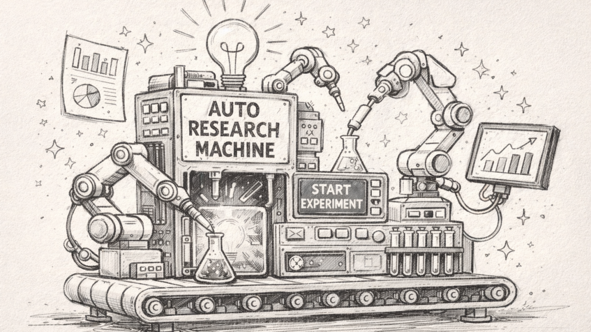

By March 2026, the history of artificial intelligence will likely be divided into two eras: the era of the "meat computer" and the era of the autonomous swarm.

For decades, frontier research was gated by the biological constraints of human engineers—individuals who required sleep, sustenance, and the cumbersome ritual of 
"group meetings" to synchronize data via low-bandwidth sound wave interconnects (speech). This manual, high-latency approach is rapidly becoming a relic. 
In the envisioned future, research is the sovereign domain of AI agents operating across compute cluster megastructures, iterating at a velocity that renders 
human intervention not only unnecessary but impossible.

Andrej Karpathy’s autoresearch repository is the "Patient Zero" of this transition. It is a lightweight, provocative demonstration of a world where the human role 
shifts from writer to architect, and the code itself becomes a living, self-optimizing organism.

### Takeaway 1: Research as a Self-Modifying Loop

The core of autoresearch is a continuous, closed-loop evolutionary process. While the human sleeps, an AI agent—acting as a autonomous researcher—applies relentless 
evolutionary pressure to a single file: train.py.

This is not a simple hyperparameter sweep. In this framework, everything is fair game. The agent can modify the neural architecture, swap out the training loop, or 
rewrite the optimizer logic (which defaults to a sophisticated mix of Muon and AdamW). After each modification, the agent triggers a training run and measures its success 
against **val_bpb** (validation bits per byte).

Because val_bpb is vocab-size-independent, it acts as a universal fitness function, allowing the agent to objectively compare wildly different architectural experiments. 
If a change improves the metric, it is assimilated; if not, it is discarded. This represents a fundamental climb up the abstraction ladder: we are no longer optimizing 
the model; we are optimizing the process that optimizes the model.

### Takeaway 2: The Radical Philosophy of the 5-Minute Constraint
The most profound architectural decision in the project is the "Fixed Time Budget." Every training run is hard-capped at exactly five minutes of wall-clock time.

By holding time constant rather than total training steps, Karpathy forces the AI to solve for **efficiency on actual hardware**. 
This constraint yields approximately 12 experiments per hour, or 100 per night, providing two major advantages:

- Direct Architectural Comparability: Whether the agent increases the model's depth or alters the batch size, the question remains the same: 
What is the *best possible loss achievable in 300 seconds*? This makes disparate experiments instantly comparable.

- Hardware-Specific Evolution: The agent is forced to discover the most efficient utilization of the specific silicon it inhabits (such as an NVIDIA H100). 
The resulting code isn't just "good"; it is an emergent property of the available compute.

### Takeaway 3: The Human as the "Research Org" Architect
In this new paradigm, the human engineer stops writing Python and starts "programming the program." The repository logic is partitioned into three distinct layers:

- **prepare.py**: The bedrock. It handles data downloading, BPE tokenization, and utility functions. It is static and serves as the environment in which the research occurs.
- **train.py**: The agent’s sandbox. Karpathy chose to keep the model, optimizer, and training loop in a single file to keep the scope manageable and make the 
agent’s "diffs" easily reviewable by the human orchestrator.
- **program.md**: The human’s lever. This is the only file the human modifies. It contains the high-level instructions, "skills," and meta-strategies for the agent.

The human’s job is now to iterate on the program.md instructions to find the "research org code" that produces the fastest progress. You aren't coding a model; you are coding a researcher.

### Takeaway 4: Emergence Within the Megastructure
One surprising consequence of hardware-specific evolution is that the "best" model becomes uniquely tailored to its environment. A model optimized on a single H100 may differ 
significantly from one evolved on a consumer-grade 4090. While this makes results less comparable across different users, it ensures that each model is perfectly tuned for 
its specific "compute cluster megastructure."

This is the beginning of software that is no longer portable in the traditional sense, but rather "native" to the hardware that birthed it. By focusing on a 
"single GPU, single file, one metric" approach, the project strips away the bloat of distributed training to focus on the pure velocity of autonomous discovery.

### The Forward-Looking Summary
The autoresearch repository is a window into a future where software is a "story of how it all began." We are moving toward a reality where we might look at 
the "10,205th generation of a codebase" and find something unrecognizable.

As the agent-led iterations accumulate, the code will inevitably transform into a self-modifying binary that has grown beyond human comprehension—a black box of peak efficiency that no "meat computer" could have designed from first principles. We are transitioning from an era of manual instruction to an era of objective-driven evolution.

The future of AI is no longer being written; it is being evolved.