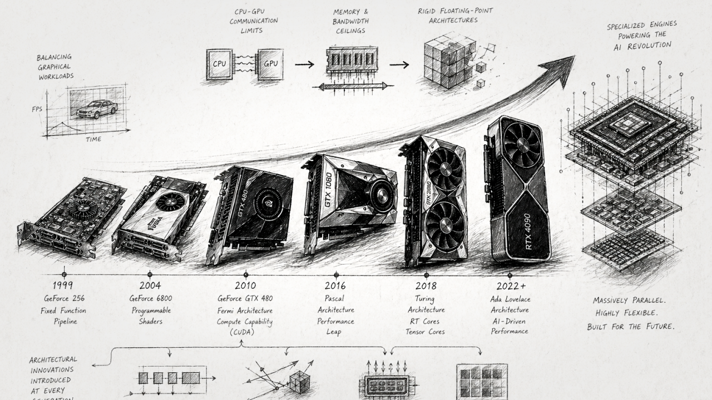

The architectural evolution of NVIDIA GPUs is a masterclass in solving cascading bottlenecks. It represents a multi-decade journey from hardcoded graphics renderers into highly flexible, 
massively parallel computing platforms, and ultimately, into the specialized engines driving the global artificial intelligence boom.

Initially, the challenge was balancing graphical workloads. But as developers realized the mathematical potential of GPUs, the bottlenecks shifted: first to CPU-GPU communication limits, 
then to physical memory and bandwidth ceilings, and eventually to the rigid nature of traditional floating-point math architectures that were ill-equipped for the massive matrix calculations 
required by neural networks. 

At every generation, NVIDIA redesigned its core architecture to solve the specific limitation of the era, introducing industry-first concepts like hardware-managed work queues, 
dedicated ray-tracing intersections, asynchronous memory accelerators, and dynamic precision scaling.

Here is an in-depth breakdown of the challenges faced at each stage, the core ideas introduced to solve them, and the fascinating technical innovations behind them.

### The Tesla Architecture (2006): The Unified Compute Paradigm

**The Challenge**: Prior to 2006, the GPU pipeline was rigidly split into fixed-function vertex processors (handling geometric shapes) and pixel processors (handling shading). 
Because workloads vary wildly—a scene might be geometrically complex but simple to shade—this hardcoded division caused severe inefficiencies where one set of processors bottlenecked while the other sat idle. 

**The Core Idea & Innovation**: Tesla solved this by introducing the Unified Graphics and Computing Architecture. By replacing specialized pipelines with a scalable array of generic 
Streaming Multiprocessors (SMs), the GPU could dynamically load-balance vertex and pixel workloads on the fly. Because these processors were generalized, NVIDIA introduced CUDA, enabling 
developers to write non-graphics parallel programs in C. 

Tesla utilized a **Single-Instruction, Multiple-Thread (SIMT)** execution model, grouping threads into "warps" of 32. To allow these massive arrays of threads to communicate, 
Tesla introduced the concept of the **Cooperative Thread Array (CTA)** (or thread block), allowing threads to synchronize and share data in low-latency shared memory, fundamentally changing 
how algorithms were mapped to hardware.

### Kepler (2012): Unshackling the GPU from the CPU

**The Challenge**: GPUs historically relied completely on the host CPU to dispatch every single task. If the GPU generated intermediate results that required a new execution path, 
it had to stop, communicate back to the CPU, and wait. Furthermore, multiple parallel streams from the CPU were multiplexed into a single hardware work queue on the GPU, 
creating "false serialization" where independent tasks blocked each other. 

**The Core Idea & Innovation**: Kepler introduced **Dynamic Parallelism and Hyper-Q**. Dynamic Parallelism granted the GPU the autonomy to spawn its own threads, synchronize, 
and schedule new work directly on the hardware via a new Grid Management Unit (GMU), entirely eliminating the CPU round-trip. To fix the queuing bottleneck, Hyper-Q expanded the single 
hardware queue into 32 simultaneous hardware-managed work queues, drastically maximizing GPU utilization. Kepler also introduced **GPUDirect RDMA**, allowing third-party devices like network 
adapters to access GPU memory directly without the CPU buffering the data.

### Maxwell (2014): The Efficiency Leap

**The Challenge**: As GPU adoption spread, power consumption and thermal limits became the primary barrier to scaling compute density, particularly in servers and laptops. 

**The Core Idea & Innovation**: Maxwell completely redesigned the Streaming Multiprocessor (SMM) with an extreme focus on performance-per-watt. By overhauling control logic partitioning, 
workload balancing, and compiler-based scheduling, Maxwell delivered radically higher efficiency. To save die area and power, Maxwell unified the functionality of the L1 cache and texture caches 
into a single, highly efficient unit.

### Pascal (2016): Shattering the Data Movement Bottleneck

**The Challenge**: As deep learning datasets grew, scaling across multiple GPUs became mandatory. However, the standard PCIe bus was severely bottlenecking data transfers. Additionally, traditional memory chips were hitting a ceiling in physical footprint and bandwidth. 

**The Core Idea & Innovation**: Pascal bypassed the PCIe bottleneck with **NVLink**, a dedicated high-speed interconnect for GPU-to-GPU communication. It also solved the memory wall by introducing 
**HBM2 (High Bandwidth Memory)**. HBM2 replaced traditional flat memory chips with vertical memory dies stacked directly next to the GPU on a silicon interposer, drastically increasing bandwidth while shrinking 
the physical footprint. Pascal also revolutionized memory management by expanding **Unified Memory** with 49-bit virtual addressing and hardware page faulting, allowing the GPU to seamlessly process datasets larger 
than its physical memory by paging data back and forth from the CPU.

### Volta (2017): Specialized Matrix Math & True Thread Autonomy

**The Challenge**: Standard single-precision (FP32) arithmetic units were inefficient for the massive matrix-multiply-accumulate operations required by neural networks. Furthermore, the traditional SIMT execution 
model forced all threads in a 32-thread warp to share a single program counter. If threads inside a warp diverged (e.g., taking different paths in an if/else statement), they executed serially until they reconverged, 
which made fine-grained synchronization prone to deadlocks. 

**The Core Idea & Innovation**: Volta physically transformed the SM by adding **Tensor Cores**, and completely rewrote thread execution with **Independent Thread Scheduling**. The first-generation Tensor Cores could calculate 
a 4x4 matrix operation in a single clock cycle, mixing FP16 inputs with FP32 accumulation to boost deep learning throughput. Even more critically, Independent Thread Scheduling equipped every single thread with its own 
program counter and execution state. This allowed highly complex, data-dependent algorithms—like inserting nodes into a doubly-linked list using fine-grained locks—to run safely at the hardware level without deadlocking 
the warp.

### Turing (2018): Hybrid Rendering & Vision AI

**The Challenge**: Real-time ray tracing was deemed computationally impossible for single GPUs because calculating ray-triangle intersections in software choked the programmable shaders. 
Rendering also wasted massive compute power by shading details the user couldn't even see. 

**The Core Idea & Innovation**: Turing fused programmable shading, real-time ray tracing, and AI into a **Hybrid Rendering** model. Turing embedded dedicated **RT Cores** directly into the hardware to autonomously 
accelerate bounding-box and ray-intersection calculations. To optimize shading efficiency, Turing introduced **Variable Rate Shading (VRS)**. VRS decouples shading rate from resolution, allowing the GPU to 
dynamically reduce shading precision on fast-moving objects or in the player's peripheral vision (Foveated Rendering) to save massive amounts of compute. Turing also added INT8 and INT4 precision Tensor Cores and 
introduced **DLSS**, using deep neural networks to extract multidimensional features and predict high-resolution images, replacing computationally heavy anti-aliasing techniques.

### Ampere & Ada Lovelace (2020-2022): Scaling the AI Factory

**The Challenge**: Moving to lower precisions for AI inferencing required complex code rewriting, and ray tracing geometry intersections were still stalling the graphics pipeline. 

**The Core Idea & Innovation**: Ada Lovelace delivered fourth-generation Tensor Cores with native **FP8 precision** and **Shader Execution Reordering (SER)**. Because ray tracing workloads are highly 
unpredictable (rays bounce in random directions), threads quickly become divergent and inefficient. SER acts as a dynamic hardware scheduler that reorders rendering tasks on the fly, grouping similar 
memory accesses and shader executions together to maintain high GPU saturation.

### Hopper (2022): Architecting for Large Language Models (LLMs)

**The Challenge**: Trillion-parameter LLMs take months to train and choke on data movement latency. Compute threads were spending too much time calculating memory addresses and moving data rather 
than actually doing math. 

**The Core Idea & Innovation**: Hopper revolutionized training with the **Transformer Engine** and the **Tensor Memory Accelerator (TMA)**. The Transformer Engine dynamically analyzes neural network layers and 
automatically switches between FP8 and 16-bit math on the fly, reducing memory bandwidth constraints while preserving statistical accuracy. To solve data movement overhead, the TMA hardware takes over 
asynchronous data transfers. Instead of compute threads manually looping to calculate memory strides and offsets, a single thread simply creates a "copy descriptor," and the TMA autonomously handles the 
massive multidimensional data transfer between global and shared memory, completely freeing the SM to focus on computation. Hopper also introduced the **Asynchronous Transaction Barrier**, which tracks both 
thread arrivals and data byte counts to seamlessly overlap memory copies with compute.

### Blackwell (2024): Defying the Silicon Limit

**The Challenge**: The physical size of a single chip is fundamentally limited by the lithography "reticle limit," making it impossible to print a larger single die. 
Additionally, data analytics platforms were heavily bottlenecked by the CPU having to decompress massive databases before the GPU could process them. 

**The Core Idea & Innovation**: Blackwell bypassed the reticle limit using a **dual-chip interconnect design** and introduced the **Second-Generation Transformer Engine**. 
Blackwell stitches two maximum-sized dies together with a staggering 10 TB/s high-bandwidth interface so they operate seamlessly as one unified GPU containing 208 billion transistors. 
Its Transformer Engine utilizes fine-grained micro-tensor scaling to unlock **4-bit floating point (FP4)** precision, effectively doubling the model size that memory can hold. 
To address data ingestion, a hardware **Decompression Engine** allows the GPU to ingest datasets directly from CPU memory at 900 GB/s, natively unpacking formats like LZ4 and Snappy to eliminate database 
bottlenecks entirely. Blackwell also integrated the first **Confidential Computing (TEE-I/O)** capability to encrypt AI models in use at near-native throughput.

### Ongoing Research: DLSS 4 & Real-Time Transformers

**The Challenge**: Previous DLSS iterations relied on Convolutional Neural Networks (CNNs) for ray reconstruction. As datasets scaled, CNNs struggled with complex motion, "disocclusions" 
(when hidden objects suddenly appear), and temporal stability, resulting in ghosting or painterly artifacts. 

**The Core Idea & Innovation**: NVIDIA abandoned CNNs and co-designed an **industry-first real-time vision Transformer architecture** specifically mapped to the execution patterns of Ada and Blackwell's FP8 Tensor Cores. 
Unlike CNNs, Transformers use an attention mechanism that excels at understanding long-range dependencies across both space and time. By meticulously aligning the network architecture with highly efficient CUDA kernels, 
this transformer packs four times the computations of the previous CNN into a real-time 1-millisecond frame budget, generating three entirely new frames for every rendered frame (Multi Frame Generation). 
This completely eliminates visual artifacts and pushes the boundaries of AI-driven real-time pipelines.

### References:

**Tesla (2006)**: *NVIDIA Tesla: A Unified Graphics and Computing Architecture*. IEEE Micro, March–April 2008.

**Kepler (2012)**: *NVIDIA’s Next Generation CUDA Compute Architecture: Kepler GK110/210*. NVIDIA Whitepaper, 2014.

**Maxwell (2014)**: *Tuning CUDA Applications for Maxwell*. NVIDIA Application Note DA-07173-001_v11.3, April 2021.

**Pascal (2016)**: *NVIDIA Tesla P100: The Most Advanced Datacenter Accelerator Ever Built (Featuring Pascal GP100)*. NVIDIA Whitepaper.

**Volta (2017)**: *NVIDIA Tesla V100 GPU Architecture: The World’s Most Advanced Data Center GPU*. NVIDIA Whitepaper WP-08608-001_v1.1, 2017.DGX Station 

**Turing (2018)**: *NVIDIA Turing GPU Architecture: Graphics Reinvented*. NVIDIA Whitepaper WP-09183-001_v01, 2018.

### NVIDIA Developer Blogs, Research, & Industry Articles

**Hopper (2022)**: *NVIDIA Hopper Architecture In-Depth*. NVIDIA Developer Blog by Michael Andersch, Greg Palmer, Ronny Krashinsky, Nick Stam, Vishal Mehta, Gonzalo Brito, and Sridhar Ramaswamy. Published March 22, 2022.

**Blackwell (2024)**: *The Engine Behind AI Factories | NVIDIA Blackwell Architecture*. NVIDIA Official Architecture Page.

**Blackwell & Overall Evolution (2025)**: *NVIDIA GPU Architecture Evolution: From Volta to Blackwell*. NADDOD AI Networking Blog by Abel, Published December 19, 2025.

**DLSS 4 & Real-Time Transformers (2025)**: *DLSS 4: Transforming Real-Time Graphics with AI*. NVIDIA Research, 2025.