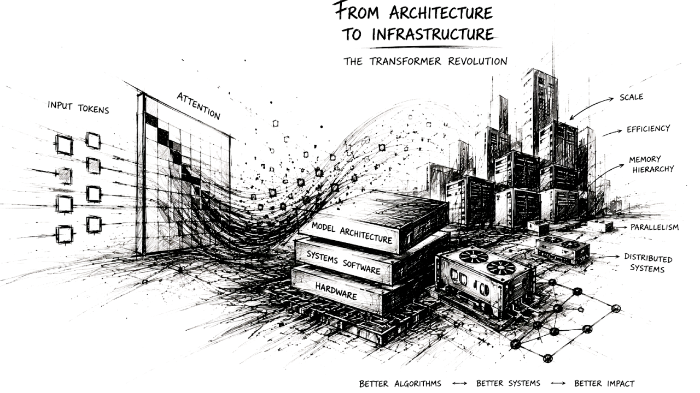

The transformer is often described as a breakthrough in machine learning architecture, and in the narrow sense, that description is entirely correct. 
Introduced in 2017 through Attention Is All You Need, the transformer replaced recurrence-based sequence modeling with a self-attention mechanism that proved dramatically more effective for capturing long-range dependencies in language and other structured data. 
The resulting shift altered the trajectory of natural language processing, eventually giving rise to modern large language models and the broader generative AI ecosystem.

Yet this account, while accurate, remains incomplete. Transformers did not merely improve sequence modeling. 

They exposed, with unusual clarity, the deep interdependence between algorithms and computational systems. As transformer models scaled from research curiosities to infrastructure underpinning production AI systems, each architectural advance revealed a new bottleneck elsewhere in the stack. Problems that initially appeared to belong to machine learning increasingly became questions of memory bandwidth, accelerator utilization, kernel design, distributed communication, and hardware architecture. In retrospect, the transformer’s significance lies not only in what it changed about modeling, but in how forcefully it reshaped the systems required to make that modeling practical.

## The Sequential Logic of Recurrent Models

Before transformers, sequence learning was dominated by recurrent neural architectures, particularly recurrent neural networks (RNNs), 
Long Short-Term Memory networks (LSTMs), and Gated Recurrent Units (GRUs). These models reflected a natural 
intuition about sequential data: language unfolds token by token, speech unfolds frame by frame, and temporal dependencies are often best represented through state carried forward over time.

This design was conceptually elegant, but computationally limiting.

A recurrent model processes one timestep at a time. The representation at time t depends on the hidden state produced 
at time t−1, which itself depends on all prior computation. This structure imposes a hard sequential dependency. 
Regardless of available hardware parallelism, a model cannot meaningfully process token 500 before token 499 has completed.

The limitations of this approach were well understood within machine learning. 
Long-range dependencies were difficult to preserve because hidden state functioned as a compressed summary of everything 
previously observed. Information degradation over long sequences was common, even with gating mechanisms intended to preserve memory. 
Optimization became increasingly unstable as sequence depth grew, particularly due to vanishing or exploding gradients.

But beyond these modeling concerns was a deeper systems mismatch.

Recurrent computation aligned poorly with modern accelerator hardware.

**Central Processing Units (CPUs)** are optimized for low-latency execution of sequential and control-heavy workloads. 
They contain relatively few sophisticated cores, aggressive branch prediction, large caches, and intricate scheduling 
logic designed to maximize single-thread responsiveness. This makes CPUs effective for workloads with branching logic, 
irregular access patterns, and fine-grained decision-making.

**Graphics Processing Units (GPUs)**, by contrast, are designed around throughput rather than latency. 
Their architecture assumes large amounts of regular arithmetic work that can be applied in parallel across many 
data elements. Rather than a handful of complex cores, GPUs expose thousands of simpler execution units optimized 
for dense linear algebra.

Recurrent models underutilized this architecture. Their dependency structure prevented the kind of large-scale 
parallel execution GPUs were built to accelerate. Even when deployed on highly capable accelerators, 
recurrent systems often remained constrained by sequential execution patterns rather than raw arithmetic capacity.

The transformer changed that relationship fundamentally.

## Reframing Sequence Modeling Through Attention

The conceptual shift introduced by transformers was not merely architectural novelty, but a different interpretation of dependency itself.

Rather than forcing information through a sequential hidden-state bottleneck, the transformer allowed tokens within 
a sequence to interact directly through self-attention. **For each token, the model computes three learned projections: 
a query vector representing the information the token seeks, a key vector representing the information it offers, 
and a value vector containing the information ultimately passed forward.**

Attention is then computed by measuring compatibility between queries and keys, normalizing those relationships, 
and using the resulting weights to aggregate values.

What made this formulation powerful was not simply mathematical elegance, but the removal of sequential 
dependency within the representation-building process.

A token no longer needed to rely on information surviving a long chain of recurrent state transitions. Dependencies between distant positions 
could be modeled directly. A token near the end of a paragraph could immediately attend to a token near the beginning if the learned relevance 
structure supported that interaction.

Equally important, this changed the computational shape of the workload.

Self-attention, feedforward projections, and embedding transformations could all be expressed as dense tensor operations. 
During training, these operations could be parallelized across entire sequences rather than serialized through time.

This alignment with accelerator-friendly computation proved decisive.

The transformer was not merely a better sequence model. It was a sequence model that mapped naturally onto the dominant compute architecture of its era.

## Compute Is Not the Whole Story

It is tempting to interpret transformer success as a straightforward consequence of better utilization of GPU arithmetic throughput. 
That interpretation, while partially true, misses the systems constraints that emerged as models scaled.

Accelerator performance is determined not only by arithmetic capability, but by memory hierarchy and data movement.

Modern GPUs expose multiple layers of memory with dramatically different performance characteristics. 
Registers, located closest to execution units, offer extremely fast access but limited capacity. 
Shared memory, often implemented as software-managed SRAM, allows fast data exchange among cooperating threads. 
Larger on-chip caches such as L2 provide broader reuse opportunities but at higher latency. 
Beyond the chip lies High Bandwidth Memory (HBM), which offers significantly greater bandwidth than conventional DRAM but remains orders of magnitude slower than on-chip storage. 
Transfers across interconnects such as PCIe or NVLink introduce additional latency and bandwidth constraints.

This hierarchy matters because data movement is often more expensive than arithmetic itself.

A GPU may be theoretically capable of extraordinary floating-point throughput, but if arithmetic units spend their time waiting for data to 
arrive from slower memory tiers, practical performance collapses. The limiting factor becomes memory bandwidth rather than compute capacity.

Transformers initially appeared well-suited to accelerators precisely because large matrix multiplications could saturate tensor compute units efficiently. 
But as model sizes and sequence lengths increased, it became clear that arithmetic efficiency alone would not determine performance.

Memory locality became equally important.

## The Quadratic Burden of Self-Attention

The architectural elegance of self-attention concealed an important scaling problem.

Each token compares itself with every other token in the sequence. For a sequence of length n, attention requires O(n²) pairwise interactions. 
This is manageable at moderate sequence lengths, but increasingly punishing as context windows expand.

At 512 tokens, the interaction count is substantial but tractable. At 8,000 tokens, it becomes significantly more expensive. At the context lengths now 
associated with production LLMs, naïve implementations become deeply inefficient.

The computational cost is obvious, but the memory implications are equally significant.

Attention requires not only similarity computation, but intermediate score storage, normalization, activation handling, and repeated tensor movement across memory tiers. 
At scale, the cost of moving intermediate attention state often becomes as significant as the arithmetic itself.

This distinction proved essential.

The challenge was no longer merely “how much computation does attention require?”

It became “where does the data live while attention is being computed?”

That shift in perspective would shape several of the most important optimizations in transformer systems.

## Training and Inference Diverged

Training and inference are often discussed together as though they represent similar computational problems. In practice, they impose very different systems constraints.

Training benefits from parallelism. Entire sequences can be processed simultaneously, batches can be aggregated, and throughput optimization dominates 
system design. The objective is to maximize arithmetic utilization while managing activation memory and communication overhead.

Inference introduces a fundamentally different workload.

Most large language models operate autoregressively, generating one token at a time. Each new token depends on all previously generated tokens. 
This creates an unavoidable sequential dependency during decoding.

The consequences are profound.

A naïve inference implementation would recompute historical attention state at every generation step. If a model generated a thousand tokens, early tokens 
would be repeatedly reprocessed hundreds or thousands of times.

This redundancy was computationally untenable.

The obvious solution was state reuse.

## KV Caching and the Shift from Compute to Memory

Key-value caching emerged from a straightforward observation: once a token’s key and value representations have been computed during autoregressive decoding, 
they do not change. Only the newly generated token introduces new attention state.

Rather than recomputing historical keys and values repeatedly, the model can cache them and reuse that state for future decoding steps.

This dramatically improves inference efficiency by eliminating redundant computation.

Yet the introduction of KV caching transformed the resource profile of inference.

Without caching, inference is computationally wasteful.

With caching, inference becomes increasingly memory-intensive.

Cache growth scales with sequence length, transformer depth, hidden dimensionality, number of attention heads, and concurrent request volume. 
For large production systems serving many users simultaneously, the cumulative KV footprint becomes enormous.

This fundamentally changes the bottleneck.

Inference is no longer constrained primarily by arithmetic throughput.

It becomes constrained by memory capacity, memory bandwidth, and efficient state management.

This transition explains much of the architectural evolution that followed.

## Architectural Adaptation: Reducing KV Pressure

The original transformer relied on multi-head attention, where each head maintained independent query, key, and value projections. 
This improved representational expressiveness by allowing different attention subspaces to specialize.

From a systems perspective, however, it was expensive.

Independent key and value representations across many heads inflated cache requirements substantially.

As inference economics became a deployment concern, architectural simplification became attractive.

Multi-Query Attention retained separate query heads while sharing keys and values across heads. This reduced cache footprint 
dramatically while preserving much of the representational benefit.

Grouped Query Attention emerged as a compromise, allowing subsets of query heads to share key-value representations rather than 
enforcing global sharing.

These changes were not driven purely by theoretical model design considerations.

They were responses to practical infrastructure constraints.

Model architecture had begun adapting to serving realities.

## FlashAttention and IO-Aware Algorithm Design

Few transformer optimizations illustrate systems thinking more clearly than FlashAttention.

It is often described simply as a faster implementation of attention, but this characterization understates its conceptual importance.

Traditional attention implementations materialized large intermediate tensors in HBM. Similarity matrices were written to memory, 
read back for normalization, written again, and consumed downstream. Arithmetic units frequently stalled while waiting for data movement.

The problem was not insufficient compute.

It was inefficient IO.

FlashAttention approached attention as a memory hierarchy problem rather than purely a numerical computation problem.

Instead of materializing the full attention matrix, computation was restructured into tiles sized to fit within fast on-chip SRAM. 
Intermediate results remained local. Memory transfers to HBM were minimized. Softmax normalization and related operations were fused 
into a more efficient execution schedule.

The mathematical output remained equivalent.

The performance improvement came from respecting hardware realities.

This was not merely an optimization.

It was evidence that transformer efficiency increasingly depended on IO-aware algorithm design.

## Serving Infrastructure as a Distinct Engineering Discipline

As transformer deployment matured, model architecture alone was no longer sufficient to define system performance.

Inference serving evolved into a specialized engineering discipline.

Quantization reduced parameter footprint and memory bandwidth consumption by lowering numerical precision. 
While this introduced calibration and accuracy tradeoffs, it substantially improved serving economics.

Speculative decoding addressed autoregressive sequentiality by allowing smaller draft models to propose candidate 
continuations that larger models could verify efficiently, improving throughput without altering output distribution.

Prefix caching reduced redundant computation for repeated prompt segments.

Continuous batching improved accelerator utilization by dynamically admitting requests into active execution rather 
than relying on rigid static batch formation.

Paged attention addressed KV cache fragmentation by borrowing ideas from virtual memory systems, enabling flexible 
allocation and improved concurrency.

Frameworks such as vLLM operationalized many of these innovations, transforming what had been research optimizations into production infrastructure.

The language model was no longer the whole system.

Serving architecture had become equally important.

## Scaling Training Beyond a Single Accelerator
Inference constraints tell only part of the story.

Training frontier-scale transformer models introduced a different class of systems challenges.

Parameter counts grew beyond the memory capacity of individual accelerators. Activation storage, optimizer state, and 
communication overhead became dominant engineering concerns.

Data parallelism alone was insufficient.

Tensor parallelism distributed matrix operations across devices.

Pipeline parallelism partitioned model layers across accelerator boundaries.

Sequence parallelism distributed work across the sequence dimension.

Mixture-of-Experts architectures reduced active compute by routing tokens selectively through specialized subnetworks.

Each approach introduced communication complexity, synchronization overhead, and new failure modes.

At sufficient scale, training large transformer systems became fundamentally a distributed systems problem.

The algorithm could not be separated from the infrastructure required to execute it.

## Hardware Adapted in Return
Perhaps the most remarkable aspect of transformer evolution is the degree to which hardware development adapted in response.

Accelerator design increasingly prioritized transformer-relevant workloads. Tensor cores accelerated dense matrix arithmetic 
central to attention and feedforward computation. HBM capacity and bandwidth became critical differentiators. 
Interconnect technologies such as NVLink addressed the communication demands of distributed model execution.

Inference accelerators emerged with architectures optimized for transformer serving workloads.

Compiler stacks, kernel libraries, and runtime scheduling increasingly became competitive differentiators.

This reflects a familiar pattern in computing history.

Hardware shapes software.

Software shapes hardware.

Transformers accelerated that feedback loop dramatically.

## The Larger Significance
The transformer is often celebrated as a machine learning breakthrough, but its broader significance lies elsewhere.

It exposed how quickly algorithmic progress encounters systems constraints.

A modeling innovation that solved sequence dependency limitations soon confronted quadratic scaling. 
Optimizations that addressed compute redundancy shifted bottlenecks into memory systems. Improvements in arithmetic 
efficiency revealed IO limitations. Infrastructure adaptations exposed distributed communication constraints.

Each solution uncovered another layer of computational reality.

That progression is what makes transformer evolution particularly instructive.

It is not merely the story of a successful neural architecture.

**It is a case study in hardware-software co-evolution, where sustained progress required adaptation across every 
layer of the computing stack.**

**The transformer changed artificial intelligence.**

**More interestingly, it changed the systems required to make artificial intelligence possible. **

## References and Further Reading
**Foundational Transformer Architecture**

Vaswani, A., Shazeer, N., Parmar, N., et al. (2017). Attention Is All You Need. NeurIPS 2017. https://arxiv.org/abs/1706.03762

**Large-Scale Inference Infrastructure**

Kwon, W., et al. (2023). vLLM: Easy, Fast, and Cheap LLM Serving with PagedAttention. https://arxiv.org/abs/2309.06180

Leviathan, Y., Kalman, M., & Matias, Y. (2023). Fast Inference from Transformers via Speculative Decoding. https://arxiv.org/abs/2211.17192

**Distributed Training and Systems Scaling**

Narayanan, D., et al. (2021). Efficient Large-Scale Language Model Training on GPU Clusters Using Megatron-LM. https://arxiv.org/abs/2104.04473

Foundational reference for tensor parallelism, pipeline parallelism, and large-scale transformer training.

NVIDIA Developer Documentation Tensor Cores and GPU Architecture https://developer.nvidia.com/tensor-cores

NVIDIA Developer Documentation NVLink High-Speed Interconnect https://www.nvidia.com/en-us/data-center/nvlink/